---
## Front matter
lang: ru-RU
title: Лабораторная работы №2
subtitle: Структуры данных
author:
  - Кузнецова С. В.
institute:
  - Российский университет дружбы народов, Москва, Россия
date: 26 сентября 2025

## i18n babel
babel-lang: russian
babel-otherlangs: english

## Formatting pdf
toc: false
toc-title: Содержание
slide_level: 2
aspectratio: 169
section-titles: true
theme: metropolis
header-includes:
 - \metroset{progressbar=frametitle,sectionpage=progressbar,numbering=fraction}
 - '\makeatletter'
 - '\beamer@ignorenonframefalse'
 - '\makeatother'
---

# Информация

## Докладчик

:::::::::::::: {.columns align=center}
::: {.column width="70%"}

  * Кузнецова София Вадимовна
  * Российский университет дружбы народов

:::
::: {.column width="30%"}

:::
::::::::::::::

# Теоретическое введение

Рассмотрим несколько структур данных, реализованных в Julia.
Несколько функций (методов), общих для всех структур данных:
– isempty() — проверяет, пуста ли структура данных;
– length() — возвращает длину структуры данных;
– in() — проверяет принадлежность элемента к структуре;
– unique() — возвращает коллекцию уникальных элементов структуры,
– reduce() — свёртывает структуру данных в соответствии с заданным бинарным оператором;
– maximum() (или minimum()) — возвращает наибольший (или наименьший) результат вызова функции для каждого элемента структуры данных.

# Ход работы

# Кортежи

## Примеры кортежей:

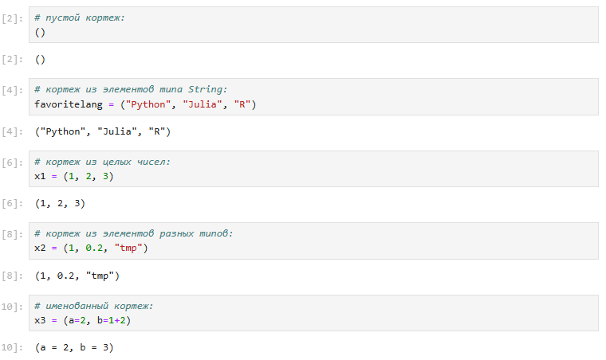{#fig-001 width=70%}

## Примеры операций над кортежами:

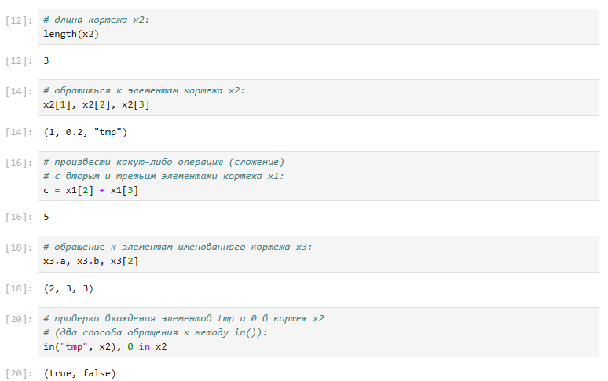{#fig-002 width=70%}

# Словари

## Примеры словарей и операций над ними:

{#fig-003 width=50%}

# Множества

## Примеры множеств и операций над ними:

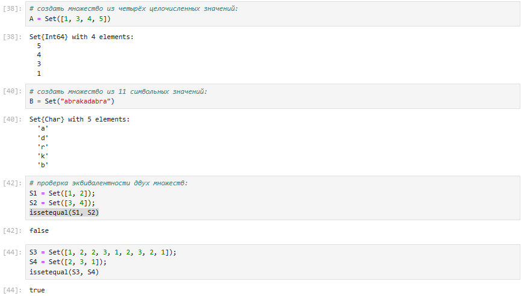{#fig-004 width=70%}

## Примеры множеств и операций над ними:

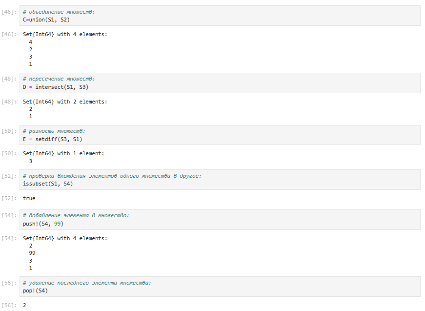{#fig-005 width=60%}

# Массивы

## Примеры массивов:

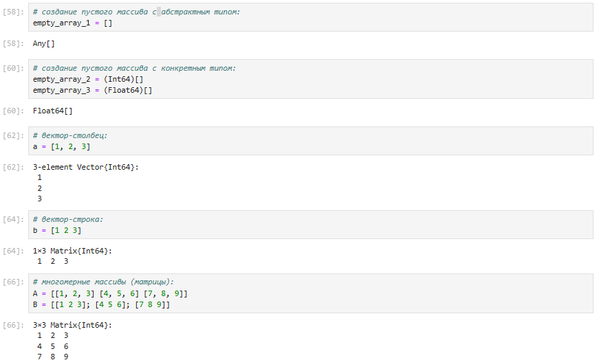{#fig-006 width=70%}

## Примеры массивов:

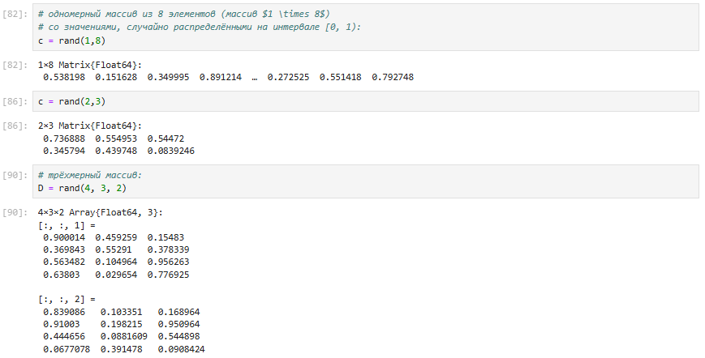{#fig-007 width=70%}

## Примеры массивов, заданных некоторыми функциями через включение:

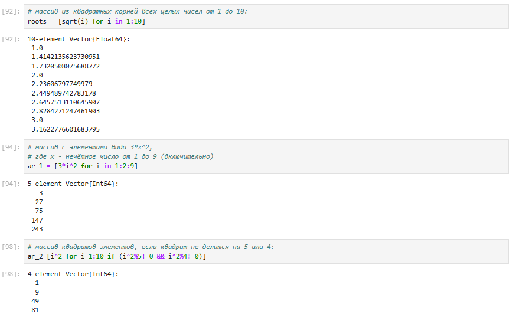{#fig-008 width=70%}

## Некоторые операции для работы с массивами:

{#fig-009 width=70%}

## Некоторые операции для работы с массивами:

{#fig-010 width=70%}

## Некоторые операции для работы с массивами:

{#fig-011 width=60%}

## Некоторые операции для работы с массивами:

{#fig-012 width=70%}

## Некоторые операции для работы с массивами:

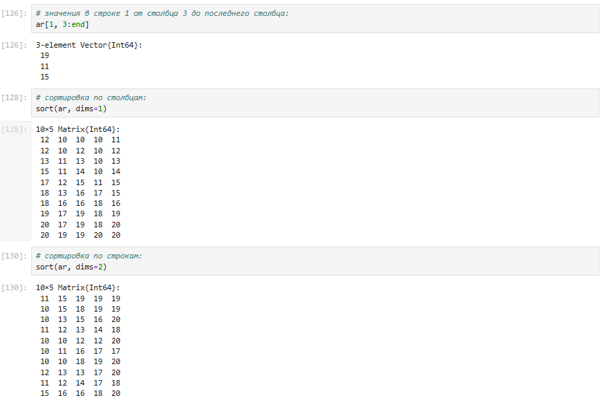{#fig-013 width=70%}

## Некоторые операции для работы с массивами:

{#fig-014 width=50%}

# Самостоятельная работа

## Выполнение заданий №1 и №2:

{#fig-015 width=70%}

## Выполнение задания №3(всех подпунктов):

{#fig-016 width=70%}

## Выполнение задания №3(всех подпунктов):

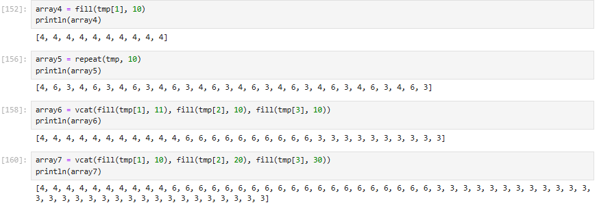{#fig-017 width=70%}

## Выполнение задания №3(всех подпунктов):

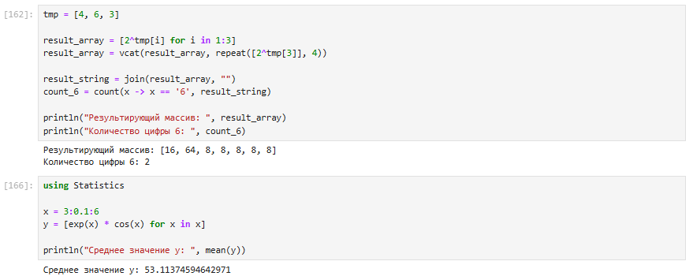{#fig-018 width=70%}

## Выполнение задания №3(всех подпунктов):

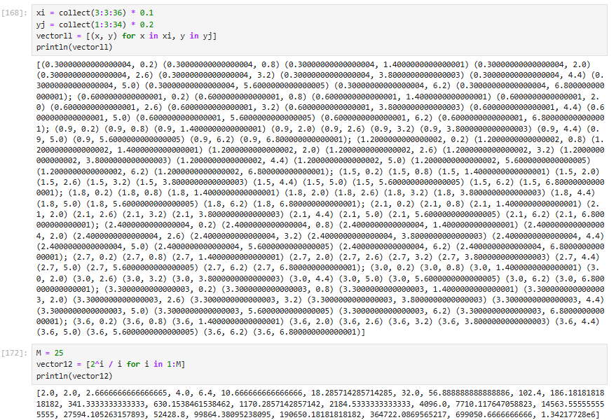{#fig-019 width=70%}

## Выполнение задания №3(всех подпунктов):

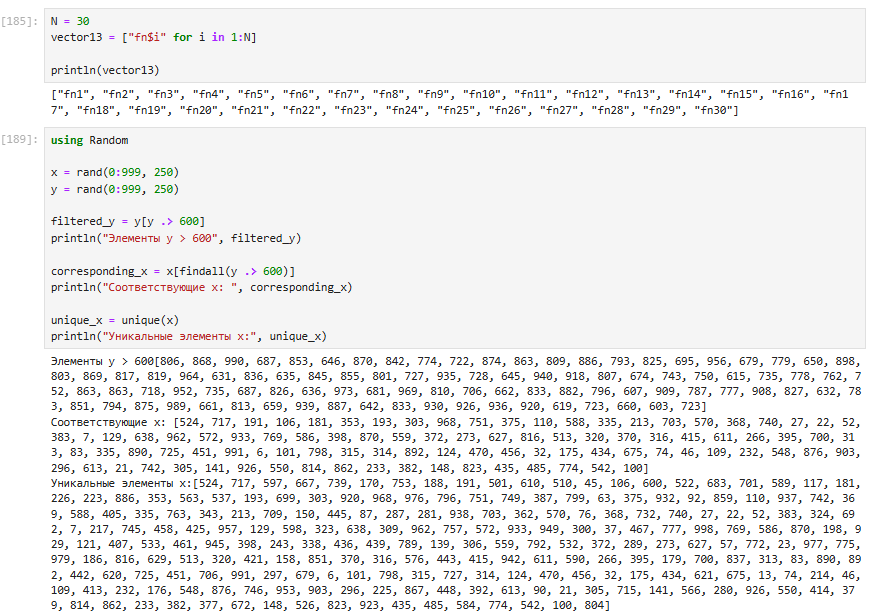{#fig-020 width=70%}

## Выполнение задания №4:

{#fig-021 width=70%}

## Выполнение задания №5:

{#fig-022 width=70%}

## Выполнение задания №6:

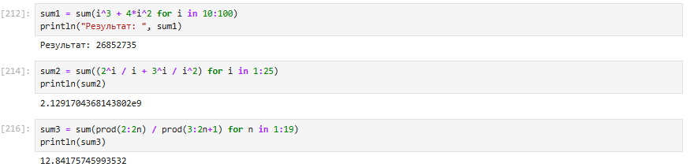{#fig-023 width=70%}

# Выводы

В ходе выполнения лабораторной работы были изучены несколько структур данных, реализованных в Julia, а также научились применять их и операции над ними для решения задач.

# Список литературы{.unnumbered}

[1] Julia Documentation: https://docs.julialang.org/en/v1/

## {.standout}

Спасибо за внимание!
