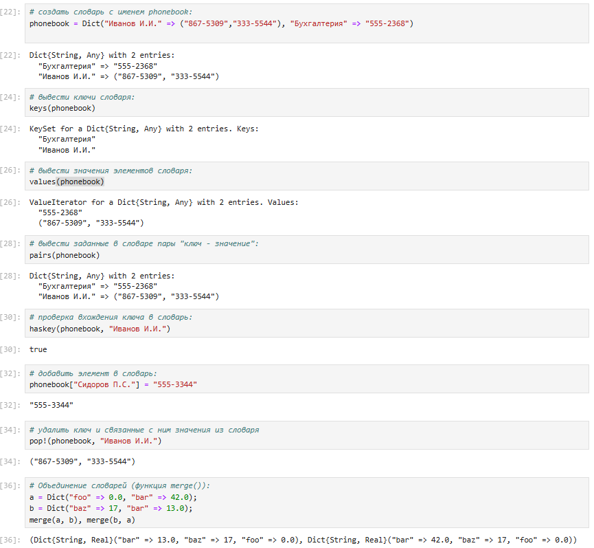
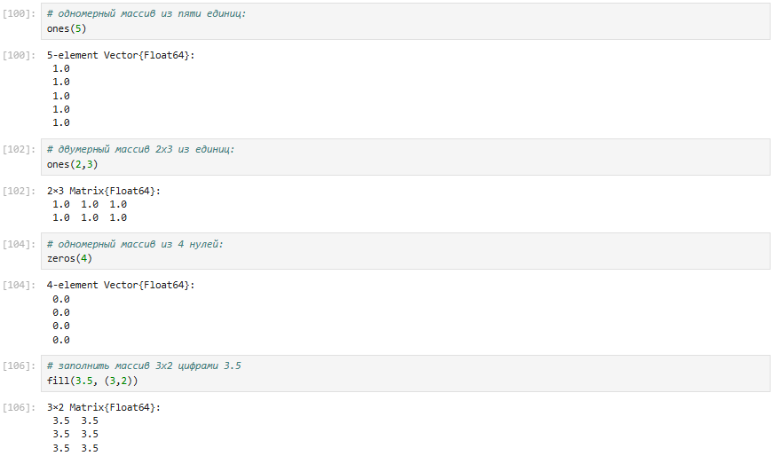
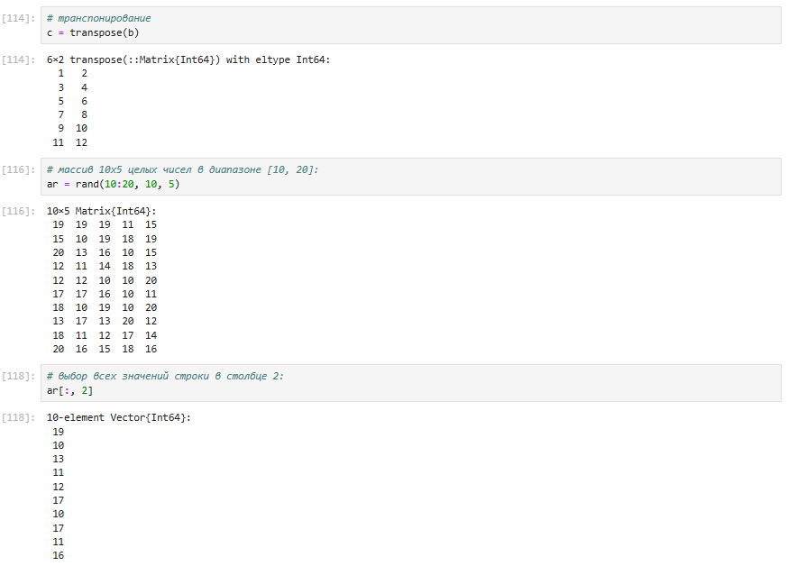
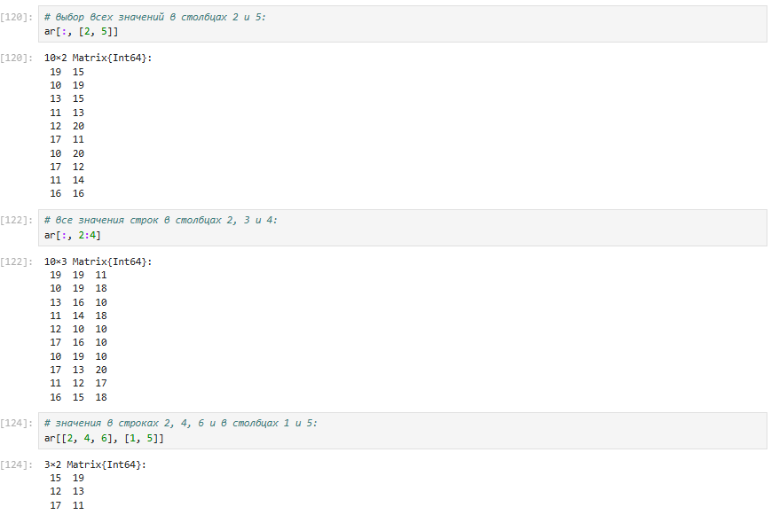
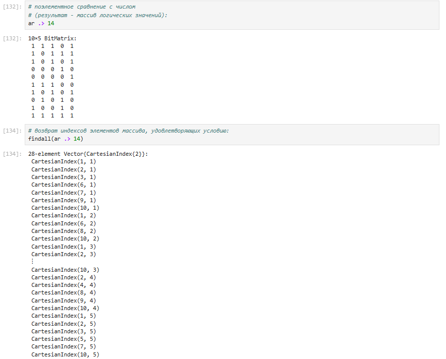
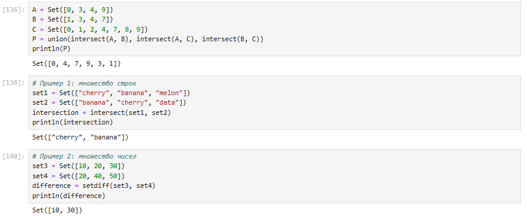
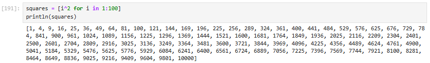
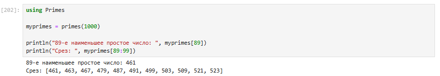

---
## Front matter
title: "Отчёт по лабораторной работе №2"
subtitle: "Структуры данных"
author: "Студент: Кузнецова София Вадимовна"

## Generic otions
lang: ru-RU
toc-title: "Содержание"

## Bibliography
bibliography: bib/cite.bib
csl: pandoc/csl/gost-r-7-0-5-2008-numeric.csl

## Pdf output format
toc: true # Table of contents
toc-depth: 2
lof: true # List of figures
lot: true # List of tables
fontsize: 12pt
linestretch: 1.5
papersize: a4
documentclass: scrreprt
## I18n polyglossia
polyglossia-lang:
  name: russian
  options:
	- spelling=modern
	- babelshorthands=true
polyglossia-otherlangs:
  name: english
## I18n babel
babel-lang: russian
babel-otherlangs: english
## Fonts
mainfont: PT Serif
romanfont: PT Serif
sansfont: PT Sans
monofont: PT Mono
mainfontoptions: Ligatures=TeX
romanfontoptions: Ligatures=TeX
sansfontoptions: Ligatures=TeX,Scale=MatchLowercase
monofontoptions: Scale=MatchLowercase,Scale=0.9
## Biblatex
biblatex: true
biblio-style: "gost-numeric"
biblatexoptions:
  - parentracker=true
  - backend=biber
  - hyperref=auto
  - language=auto
  - autolang=other*
  - citestyle=gost-numeric
## Pandoc-crossref LaTeX customization
figureTitle: "Рис."
tableTitle: "Таблица"
listingTitle: "Листинг"
lofTitle: "Список иллюстраций"
lolTitle: "Листинги"
## Misc options
indent: true
header-includes:
  - \usepackage{indentfirst}
  - \usepackage{float} # keep figures where there are in the text
  - \floatplacement{figure}{H} # keep figures where there are in the text
---

# Цель работы

Изучить несколько структур данных, реализованных в Julia, научиться применять их и операции над ними для решения задач.

# Теоретическое введение

Рассмотрим несколько структур данных, реализованных в Julia.
Несколько функций (методов), общих для всех структур данных:
– isempty() — проверяет, пуста ли структура данных;
– length() — возвращает длину структуры данных;
– in() — проверяет принадлежность элемента к структуре;
– unique() — возвращает коллекцию уникальных элементов структуры,
– reduce() — свёртывает структуру данных в соответствии с заданным бинарным оператором;
– maximum() (или minimum()) — возвращает наибольший (или наименьший) результат вызова функции для каждого элемента структуры данных.

# Выполнение лабораторной работы

## Кортежи

Кортеж (Tuple) — структура данных (контейнер) в виде неизменяемой индексируемой последовательности элементов какого-либо типа (элементы индексируются с единицы).
Синтаксис определения кортежа:
(element1, element2, ...)

Примеры кортежей:

{#fig-001 width=70%}

Примеры операций над кортежами:

{#fig-002 width=70%}

## Словари

Словарь — неупорядоченный набор связанных между собой по ключу данных.
Синтаксис определения словаря:
Dict(key1 => value1, key2 => value2, ...)

Примеры словарей и операций над ними:

{#fig-003 width=70%}

## Множества

Множество, как структура данных в Julia, соответствует множеству, как математическому объекту, то есть является неупорядоченной совокупностью элементов какого-либо типа. Возможные операции над множествами: объединение, пересечение, разность; принадлежность элемента множеству.
Синтаксис определения множества:
Set([itr])
где itr — набор значений, сгенерированных данным итерируемым объектом или пустое множество.

Примеры множеств и операций над ними:

{#fig-004 width=70%}

{#fig-005 width=70%}

## Массивы

Массив — коллекция упорядоченных элементов, размещённая в многомерной сетке.
Векторы и матрицы являются частными случаями массивов.
Общий синтаксис одномерных массивов:
array_name_1 = [element1, element2, ...]
array_name_2 = [element1 element2 ...]

Примеры массивов:

{#fig-006 width=70%}

{#fig-007 width=70%}

Примеры массивов, заданных некоторыми функциями через включение:

{#fig-008 width=70%}

Некоторые операции для работы с массивами:

{#fig-009 width=70%}

{#fig-010 width=70%}

{#fig-011 width=70%}

{#fig-012 width=70%}

{#fig-013 width=70%}

{#fig-014 width=70%}

## Самостоятельная работа

Выполнение заданий №1 и №2:

{#fig-015 width=70%}

Выполнение задания №3(всех подпунктов):

{#fig-016 width=70%}

{#fig-017 width=70%}

{#fig-018 width=70%}

{#fig-019 width=70%}

{#fig-020 width=70%}

Выполнение задания №4:

{#fig-021 width=70%}

Выполнение задания №5:

{#fig-022 width=70%}

Выполнение задания №6:

{#fig-023 width=70%}

# Выводы

В ходе выполнения лабораторной работы были изучены несколько структур данных, реализованных в Julia, а также научились применять их и операции над ними для решения задач.

# Список литературы{.unnumbered}

[1] Julia Documentation: https://docs.julialang.org/en/v1/

::: {#refs}
:::
