---
## Front matter
lang: ru-RU
title: Лабораторная работы №4
subtitle: Компьютерный практикум по статистическому анализу данных
author:
  - Кузнецова С. В.
institute:
  - Российский университет дружбы народов, Москва, Россия
date: 24 октября 2025

## i18n babel
babel-lang: russian
babel-otherlangs: english

## Formatting pdf
toc: false
toc-title: Содержание
slide_level: 2
aspectratio: 169
section-titles: true
theme: metropolis
header-includes:
 - \metroset{progressbar=frametitle,sectionpage=progressbar,numbering=fraction}
 - '\makeatletter'
 - '\beamer@ignorenonframefalse'
 - '\makeatother'
---

# Информация

## Докладчик

:::::::::::::: {.columns align=center}
::: {.column width="70%"}

  * Кузнецова София Вадимовна
  * Российский университет дружбы народов

:::
::: {.column width="30%"}

:::
::::::::::::::

# Цель

## Цель 

- Изучить возможности специализированных пакетов Julia для выполнения и оценки эффективности операций над объектами линейной алгебры.

# Выполнение 

## Поэлементные операции над многомерными массивами

{ #fig:001 width=50% }

## Использование возможностей пакета Statistics

{ #fig:002 width=70% }

## Транспонирование, след, ранг, определитель и инверсия матрицы

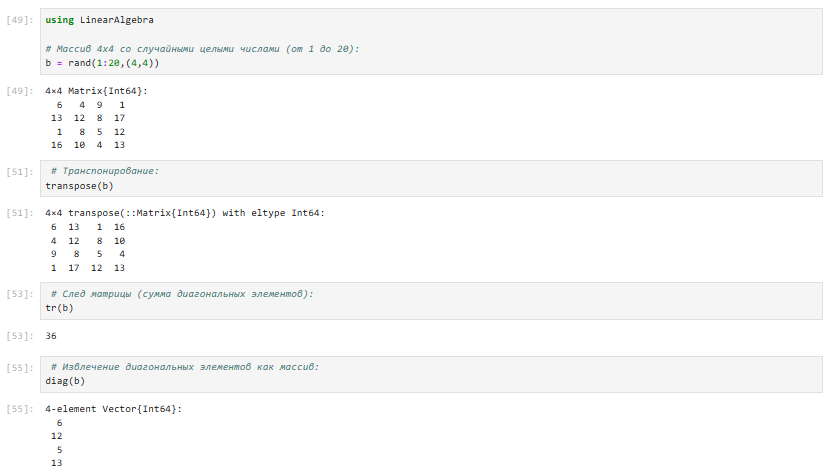{ #fig:003 width=70% }

## Транспонирование, след, ранг, определитель и инверсия матрицы

{ #fig:004 width=70%}

## Вычисление нормы векторов и матриц, повороты, вращения

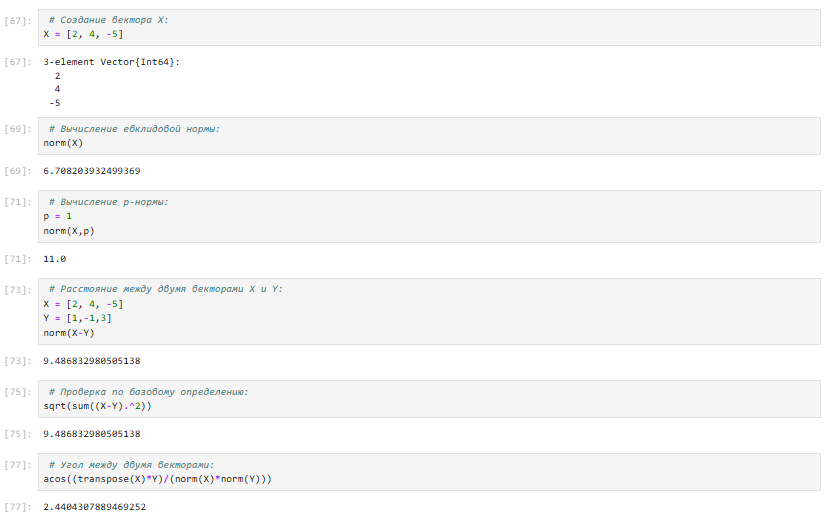{ #fig:005 width=70% }

## Вычисление нормы векторов и матриц, повороты, вращения

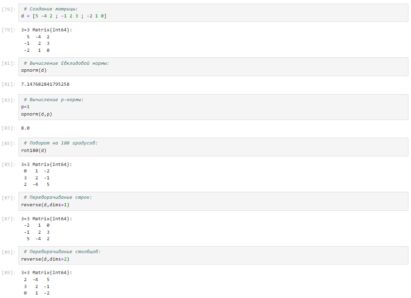{ #fig:006 width=60% }

## Матричное умножение, единичная матрица, скалярное произведение

{ #fig:007 width=60% }

## Факторизация. Специальные матричные структуры

{ #fig:008 width=70% }

## Факторизация. Специальные матричные структуры

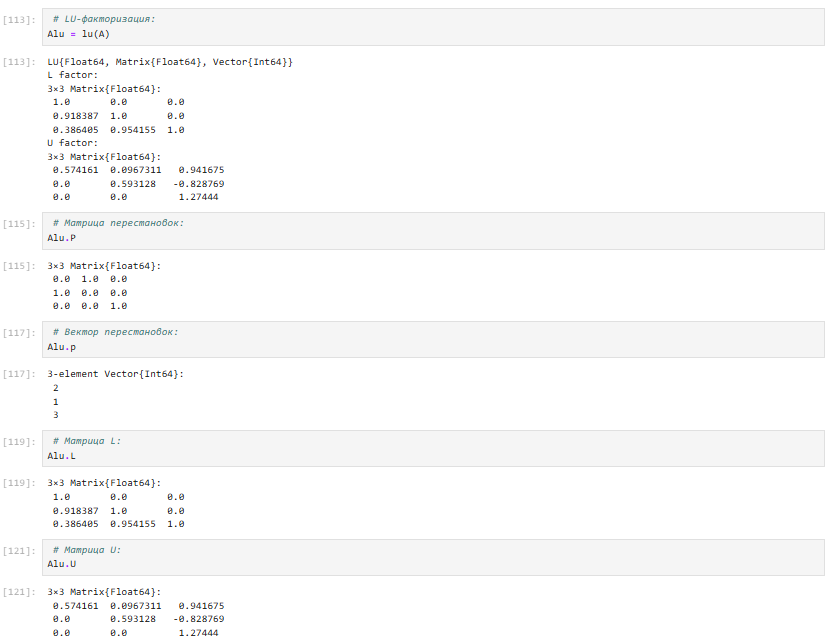{ #fig:009 width=50% }

## Факторизация. Специальные матричные структуры

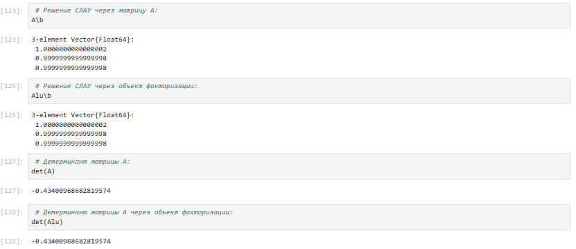{ #fig:010 width=70% }

## Факторизация. Специальные матричные структуры

{ #fig:011 width=70% }

## Факторизация. Специальные матричные структуры

{ #fig:012 width=50% }

## Факторизация. Специальные матричные структуры

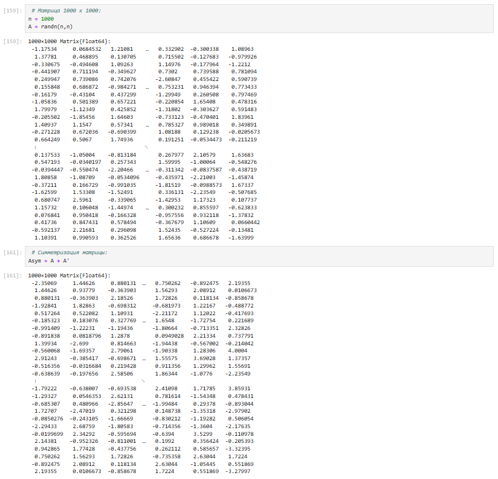{ #fig:013 width=50% }

## Факторизация. Специальные матричные структуры

{ #fig:014 width=70% }

## Факторизация. Специальные матричные структуры

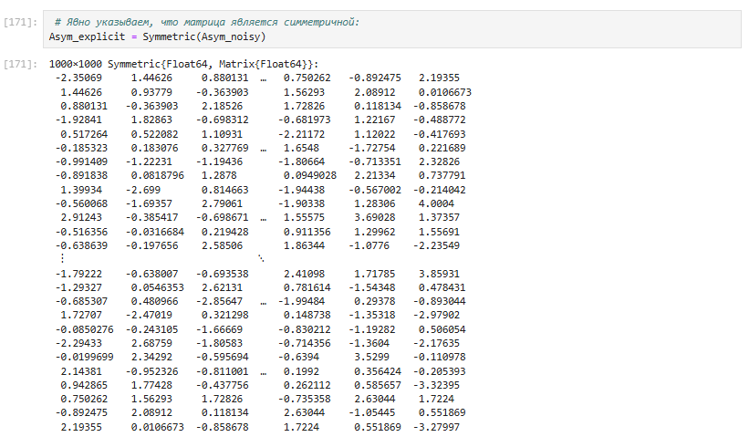{ #fig:015 width=70% }

## Факторизация. Специальные матричные структуры

{ #fig:016 width=70% }

## Факторизация. Специальные матричные структуры

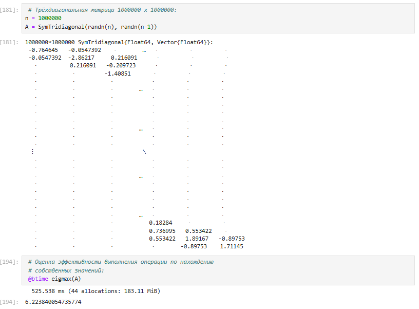{ #fig:017 width=55% }

## Общая линейная алгебра

{ #fig:018 width=55% }

# Самостоятельная работа

## Выполнение задания "Произведение векторов":

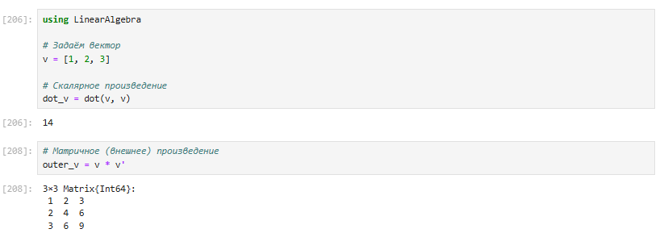{ #fig:019 width=50% }

## Выполнение задания "Системы линейных уравнений":

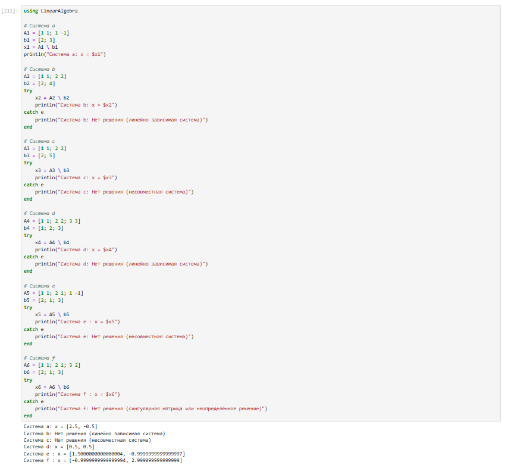{ #fig:020 width=50% }

## Выполнение задания "Системы линейных уравнений":

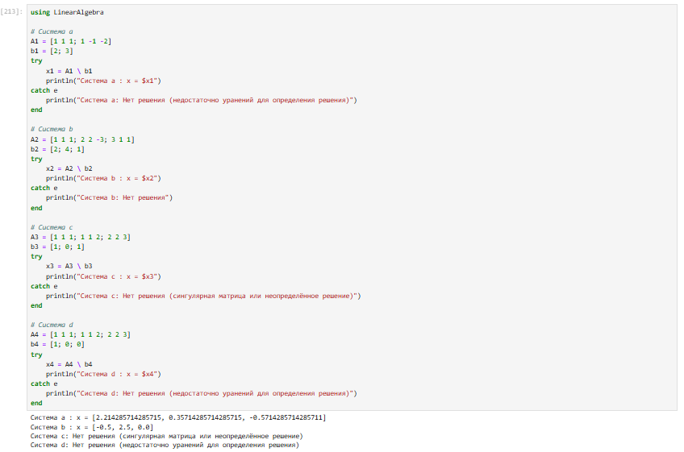{ #fig:021 width=70% }

## Выполнение задания "Операции с матрицами":

{ #fig:022 width=70% }

## Выполнение задания "Операции с матрицами":

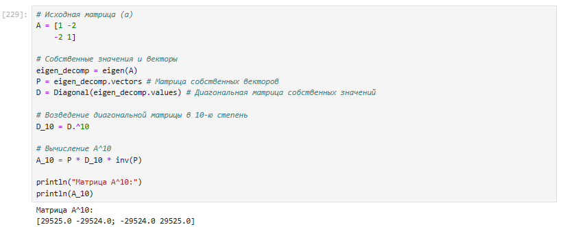{ #fig:023 width=70% }

## Выполнение задания "Операции с матрицами":

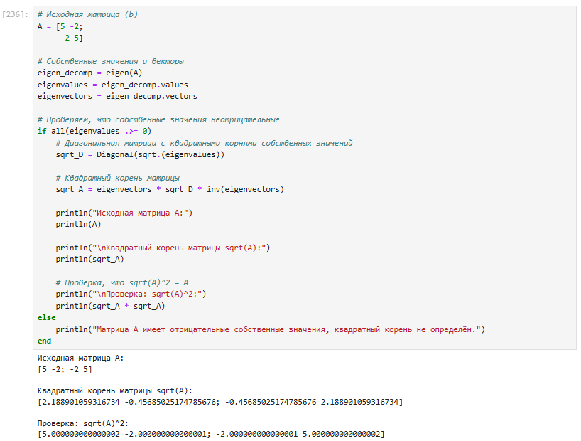{ #fig:024 width=50% }

## Выполнение задания "Операции с матрицами":

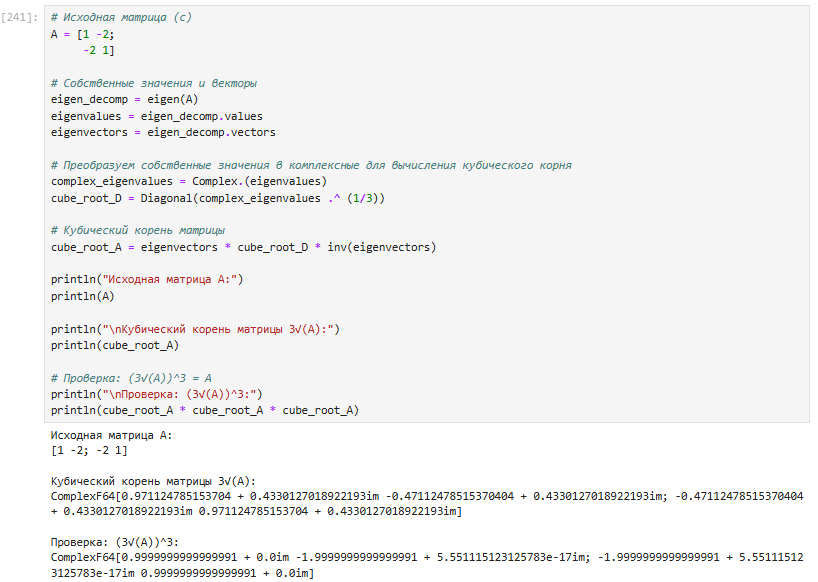{ #fig:025 width=65% }

## Выполнение задания "Операции с матрицами":

{ #fig:026 width=70% }

## Выполнение задания "Операции с матрицами":

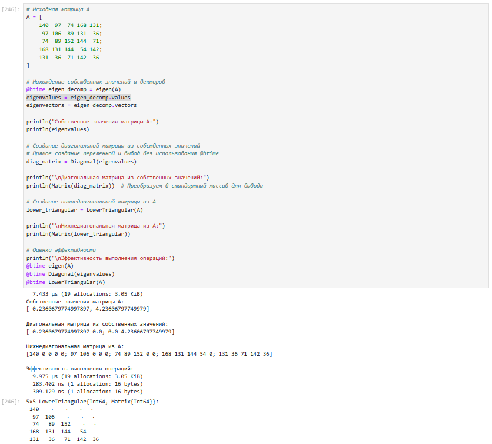{ #fig:027 width=50% }

## Выполнение задания "Линейные модели экономики":

{ #fig:028 width=50% }

# Вывод

## Вывод

- В ходе выполнения лабораторной работы были изучены возможности специализированных пакетов Julia для выполнения и оценки эффективности операций над объектами линейной алгебры.

# Список литературы. Библиография

[[1] Julia Documentation: https://docs.julialang.org/en/v1/

## {.standout}

Спасибо за внимание!
