---
## Front matter
title: "Отчёт по лабораторной работе №4"
subtitle: "дисциплина: Компьютерный практикум по статистическому анализу данных"
author: "Студент: Кузнецова София Вадимовна"

## Generic otions
lang: ru-RU
toc-title: "Содержание"

## Bibliography
bibliography: bib/cite.bib
csl: pandoc/csl/gost-r-7-0-5-2008-numeric.csl

## Pdf output format
toc: true # Table of contents
toc-depth: 2
lof: true # List of figures
lot: true # List of tables
fontsize: 12pt
linestretch: 1.5
papersize: a4
documentclass: scrreprt
## I18n polyglossia
polyglossia-lang:
  name: russian
  options:
	- spelling=modern
	- babelshorthands=true
polyglossia-otherlangs:
  name: english
## I18n babel
babel-lang: russian
babel-otherlangs: english
## Fonts
mainfont: IBM Plex Serif
romanfont: IBM Plex Serif
sansfont: IBM Plex Sans
monofont: IBM Plex Mono
mathfont: STIX Two Math
mainfontoptions: Ligatures=Common,Ligatures=TeX,Scale=0.94
romanfontoptions: Ligatures=Common,Ligatures=TeX,Scale=0.94
sansfontoptions: Ligatures=Common,Ligatures=TeX,Scale=MatchLowercase,Scale=0.94
monofontoptions: Scale=MatchLowercase,Scale=0.94,FakeStretch=0.9
mathfontoptions:
## Biblatex
biblatex: true
biblio-style: "gost-numeric"
biblatexoptions:
  - parentracker=true
  - backend=biber
  - hyperref=auto
  - language=auto
  - autolang=other*
  - citestyle=gost-numeric
## Pandoc-crossref LaTeX customization
figureTitle: "Рис."
tableTitle: "Таблица"
listingTitle: "Листинг"
lofTitle: "Список иллюстраций"
lotTitle: "Список таблиц"
lolTitle: "Листинги"
## Misc options
indent: true
header-includes:
  - \usepackage{indentfirst}
  - \usepackage{float} # keep figures where there are in the text
  - \floatplacement{figure}{H} # keep figures where there are in the text
---

# Цель работы

Основной целью работы является изучение возможностей специализированных пакетов Julia для выполнения и оценки эффективности операций над объектами линейной алгебры.

# Выполнение лабораторной работы

##  Поэлементные операции над многомерными массивами

Для матрицы 4 × 3 рассмотрим поэлементные операции сложения и произведения её элементов:

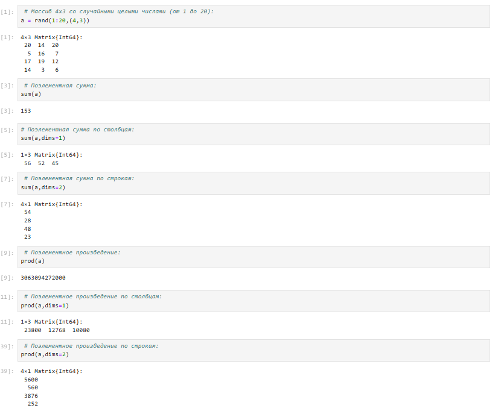{ #fig:001 width=100% height=100% }

Для работы со средними значениями можно воспользоваться возможностями пакета Statistics:

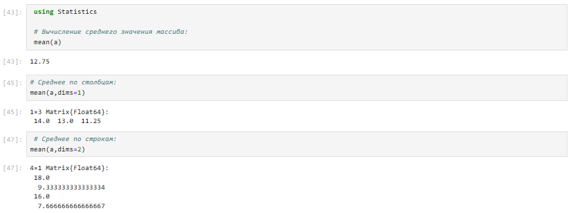{ #fig:002 width=100% height=100% }

## Транспонирование, след, ранг, определитель и инверсия матрицы

Для выполнения таких операций над матрицами, как транспонирование, диагонализация, определение следа, ранга, определителя матрицы и т.п. можно воспользоваться библиотекой (пакетом) LinearAlgebra:

{ #fig:003 width=100% height=100% }

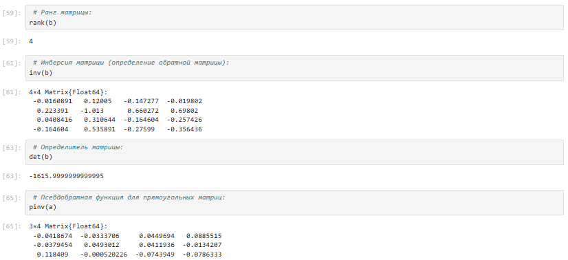{ #fig:004 width=100% height=100% }

## Вычисление нормы векторов и матриц, повороты, вращения

Для вычисления нормы используется LinearAlgebra.norm(x):

{ #fig:005 width=100% height=100% }

Вычислим нормы для двумерной матрицы:

{ #fig:006 width=100% height=100% }

## Матричное умножение, единичная матрица, скалярное произведение

Выполним примеры матричного умножения, единичной матрицы и скалярного произведения:

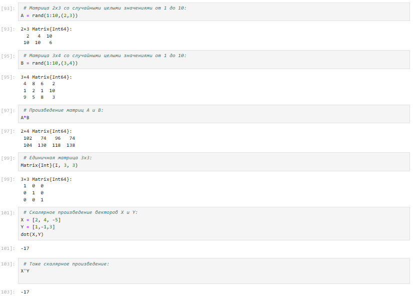{ #fig:007 width=100% height=100% }

## Факторизация. Специальные матричные структуры

Рассмотрим несколько примеров. Для работы со специальными матричными структурами потребуется пакет LinearAlgebra. 

Решение систем линейный алгебраических уравнений Ax = b:

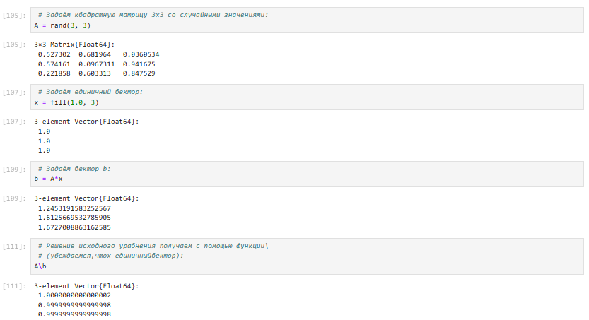{ #fig:008 width=100% height=100% }

Julia позволяет вычислять LU-факторизацию и определяет составной тип факторизации для его хранения:

{ #fig:009 width=100% height=100% }

Исходная система уравнений Ax = b может быть решена или с использованием исходной матрицы, или с использованием объекта факторизации:

{ #fig:010 width=100% height=100% }

Julia позволяет вычислять QR-факторизацию и определяет составной тип факторизации для его хранения:

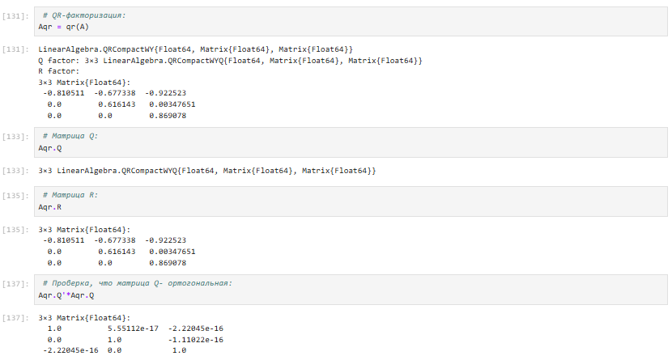{ #fig:011 width=100% height=100% }

Примеры собственной декомпозиции матрицы A:

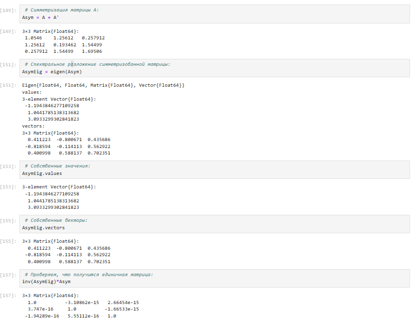{ #fig:012 width=100% height=100% }

Далее рассмотрим примеры работы с матрицами большой размерности и специальной структуры:

{ #fig:013 width=100% height=100% }

Пример добавления шума в симметричную матрицу (матрица уже не будет симметричной):

{ #fig:014 width=100% height=100% }

В Julia можно объявить структуру матрица явно, например, используя Diagonal, Triangular, Symmetric, Hermitian, Tridiagonal и SymTridiagonal:

{ #fig:015 width=100% height=100% }

Далее для оценки эффективности выполнения операций над матрицами большой размерности и специальной структуры воспользуемся пакетом BenchmarkTools:

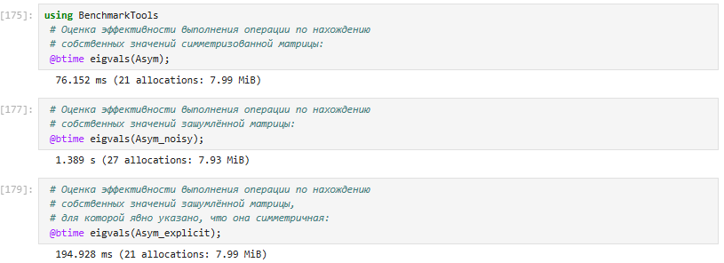{ #fig:016 width=100% height=100% }

Далее рассмотрим примеры работы с разряженными матрицами большой размерности.

Использование типов Tridiagonal и SymTridiagonal для хранения трёхдиагональных матриц позволяет работать с потенциально очень большими трёхдиагональными матрицами:

{ #fig:017 width=100% height=100% }

## Общая линейная алгебра

В примере показано, как можно решить систему линейных уравнений с рациональными элементами без преобразования в типы элементов с плавающей запятой (для избежания проблемы с переполнением используем BigInt):

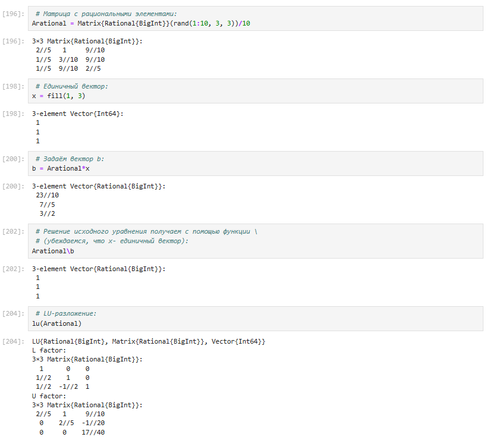{ #fig:018 width=100% height=100% }

## Самостоятельная работа

Выполнение задания "Произведение векторов":

{ #fig:019 width=100% height=100% }

Выполнение задания "Системы линейных уравнений":

{ #fig:020 width=100% height=100% }

{ #fig:021 width=100% height=100% }

Выполнение задания "Операции с матрицами":

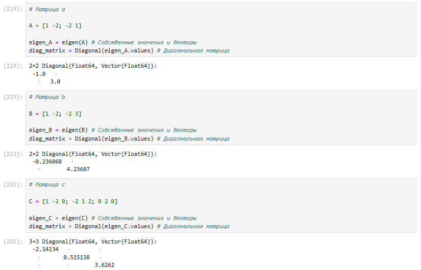{ #fig:022 width=100% height=100% }

{ #fig:023 width=100% height=100% }

{ #fig:024 width=100% height=100% }

{ #fig:025 width=100% height=100% }

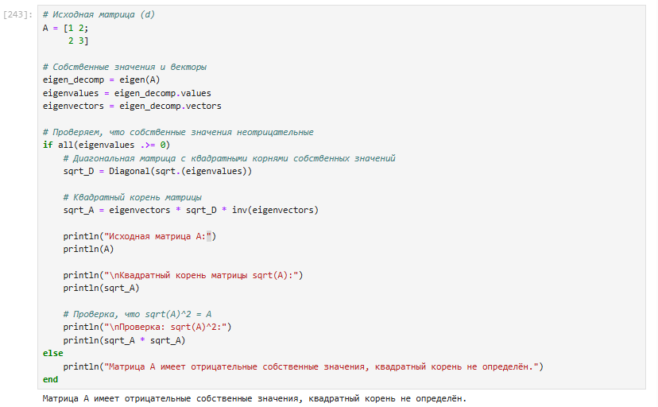{ #fig:026 width=100% height=100% }

{ #fig:027 width=100% height=100% }

Выполнение задания "Линейные модели экономики":

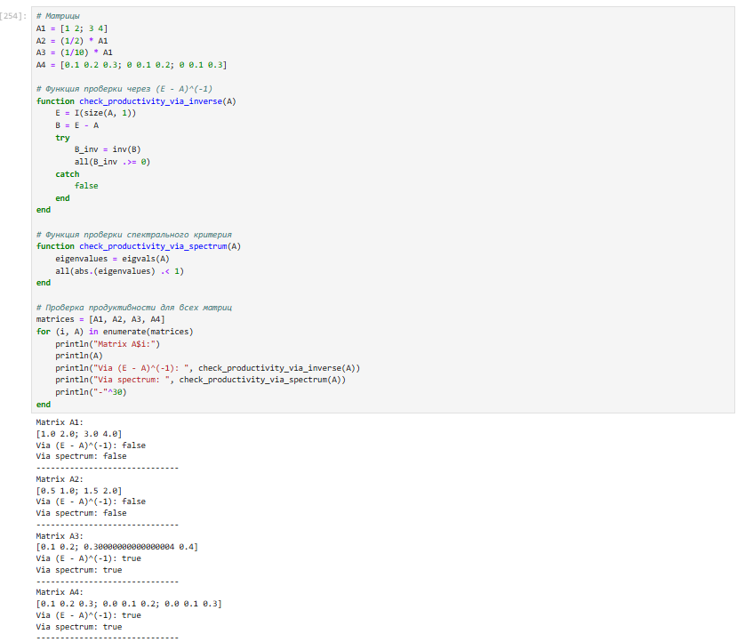{ #fig:028 width=100% height=100% }

# Выводы

В ходе выполнения лабораторной работы были изучены возможности специализированных пакетов Julia для выполнения и оценки эффективности операций над объектами линейной алгебры.

# Список литературы. Библиография

[1] Julia Documentation: https://docs.julialang.org/en/v1/
