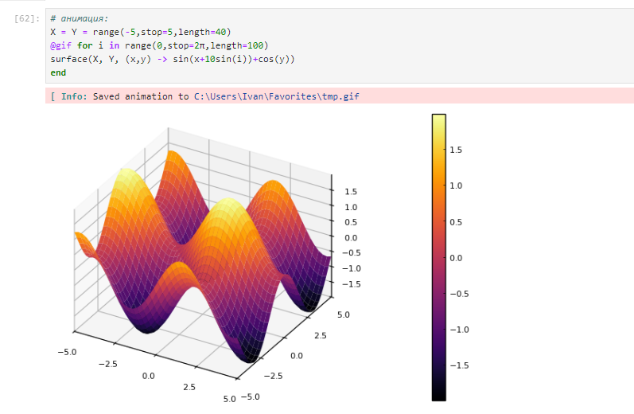
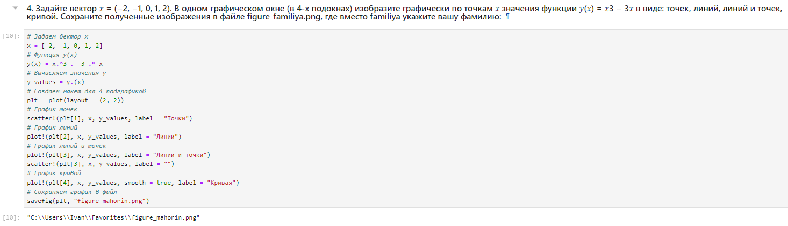
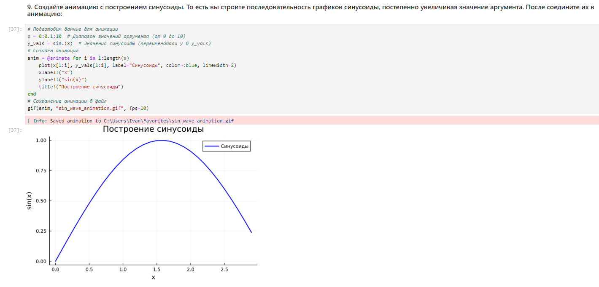

---
## Front matter
lang: ru-RU
title: Лабораторная работа № 5
subtitle: Компьютерный практикум по статистическому анализу данных
author:
  - Кузнецова С.В.
institute:
  - Российский университет дружбы народов, Москва, Россия
 
## i18n babel
babel-lang: russian
babel-otherlangs: english

## Formatting pdf
toc: false
toc-title: Содержание
slide_level: 2
aspectratio: 169
section-titles: true
theme: metropolis
header-includes:
 - \metroset{progressbar=frametitle,sectionpage=progressbar,numbering=fraction}
---

# Информация

## Докладчик

:::::::::::::: {.columns align=center}
::: {.column width="70%"}

  * Кузнецова София Вадимовна
  * Российский университет дружбы народов

:::
::: {.column width="25%"}

:::
::::::::::::::

## Цель лабораторной работы

- Освоить синтаксис языка Julia для построения графиков.

# Выполнение лабораторной работы

## Основные пакеты для работы с графиками в Julia

{ #fig:001 width=80% height=80% }

## Основные пакеты для работы с графиками в Julia

{ #fig:002 width=80% height=80% }

## Опции при построении графика

{ #fig:003 width=80% height=80% }

## Опции при построении графика

{ #fig:004 width=80% height=80% }

## Опции при построении графика

{ #fig:005 width=80% height=80% }

## Опции при построении графика

{ #fig:006 width=80% height=80% }

## Точечный график

{ #fig:007 width=80% height=80% }

## Точечный график

{ #fig:008 width=80% height=80% }

## Точечный график

{ #fig:009 width=80% height=80% }

## Аппроксимация данных

{ #fig:010 width=80% height=80% }

## Аппроксимация данных

{ #fig:011 width=80% height=80% }

## Две оси ординат

{ #fig:012 width=80% height=80% }

## Полярные координаты

{ #fig:013 width=80% height=80% }

## Параметрический график

{ #fig:014 width=80% height=80% }

## Параметрический график

{ #fig:015 width=80% height=80% }

## График поверхности

{ #fig:016 width=80% height=80% }

## График поверхности

{ #fig:017 width=80% height=80% }

## График поверхности

{ #fig:018 width=80% height=80% }

## График поверхности

{ #fig:019 width=80% height=80% }

## Линии уровня

{ #fig:020 width=80% height=80% }

## Линии уровня

{ #fig:021 width=80% height=80% }

## Линии уровня

{ #fig:022 width=80% height=80% }

## Векторные поля

{ #fig:023 width=80% height=80% }

## Векторные поля

{ #fig:024 width=80% height=80% }

## Анимация

{ #fig:025 width=80% height=80% }

## Анимация

{ #fig:026 width=80% height=80% }

## Гипоциклоида

{ #fig:027 width=80% height=80% }

## Гипоциклоида

{ #fig:028 width=80% height=80% }

## Гипоциклоида

{ #fig:029 width=80% height=80% }

## Гипоциклоида

{ #fig:030 width=80% height=80% }

## Гипоциклоида

{ #fig:031 width=80% height=80% }

## Errorbars

{ #fig:032 width=80% height=80% }

## Errorbars

{ #fig:033 width=80% height=80% }

## Errorbars

{ #fig:034 width=80% height=80% }

## Errorbars

{ #fig:035 width=80% height=80% }

## Errorbars

{ #fig:036 width=80% height=80% }

## Errorbars

{ #fig:037 width=80% height=80% }

## Использование пакета Distributions

{ #fig:038 width=80% height=80% }

## Использование пакета Distributions

{ #fig:039 width=80% height=80% }

## Использование пакета Distributions

{ #fig:040 width=80% height=80% }

## Подграфики

{ #fig:041 width=80% height=80% }

## Подграфики

{ #fig:042 width=80% height=80% }

## Подграфики

{ #fig:043 width=80% height=80% }

## Подграфики

{ #fig:044 width=80% height=80% }

## Подграфики

{ #fig:045 width=80% height=80% }

## Самостоятельное выполнение

{ #fig:046 width=80% height=80% }

## Самостоятельное выполнение

{ #fig:047 width=80% height=80% }

## Самостоятельное выполнение

{ #fig:048 width=80% height=80% }

## Самостоятельное выполнение

{ #fig:049 width=80% height=80% }

## Самостоятельное выполнение

{ #fig:050 width=80% height=80% }

## Самостоятельное выполнение

{ #fig:052 width=80% height=80% }

## Самостоятельное выполнение

{ #fig:053 width=80% height=80% }

## Самостоятельное выполнение

{ #fig:054 width=80% height=80% }

## Самостоятельное выполнение

{ #fig:055 width=80% height=80% }

## Самостоятельное выполнение

{ #fig:056 width=80% height=80% }

## Самостоятельное выполнение

{ #fig:057 width=80% height=80% }

## Выводы

В ходе выполнения лабораторной работы был освоен синтаксис языка Julia для построения графиков.

## {.standout}

Спасибо за внимание!
