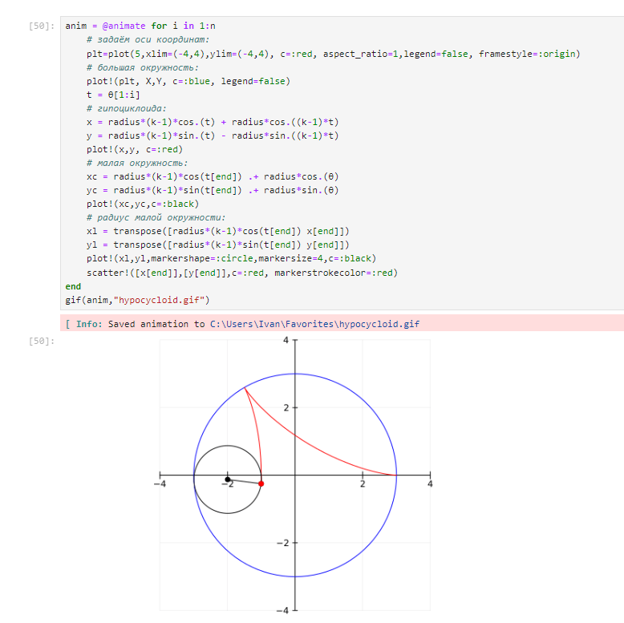
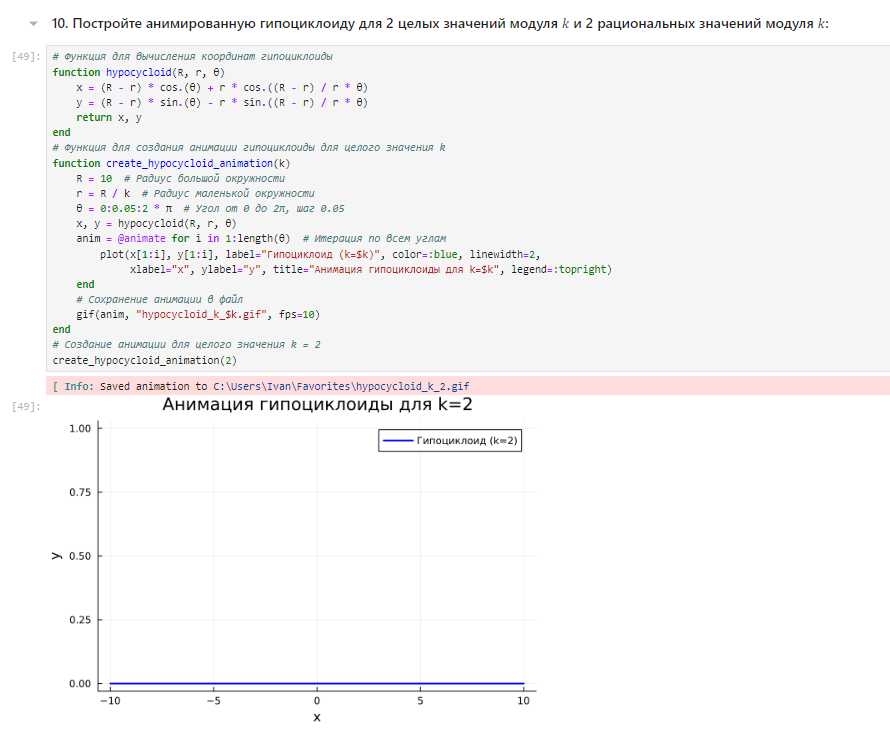

---
## Front matter
title: "Отчёт по лабораторной работе №5"
subtitle: "дисциплина: Компьютерный практикум по статистическому анализу данных"
author: "Студент: Кузнецова София Вадимовна"

## Generic otions
lang: ru-RU
toc-title: "Содержание"

## Bibliography
bibliography: bib/cite.bib
csl: pandoc/csl/gost-r-7-0-5-2008-numeric.csl

## Pdf output format
toc: true # Table of contents
toc-depth: 2
lof: true # List of figures
lot: true # List of tables
fontsize: 12pt
linestretch: 1.5
papersize: a4
documentclass: scrreprt
## I18n polyglossia
polyglossia-lang:
  name: russian
  options:
	- spelling=modern
	- babelshorthands=true
polyglossia-otherlangs:
  name: english
## I18n babel
babel-lang: russian
babel-otherlangs: english
## Fonts
mainfont: IBM Plex Serif
romanfont: IBM Plex Serif
sansfont: IBM Plex Sans
monofont: IBM Plex Mono
mathfont: STIX Two Math
mainfontoptions: Ligatures=Common,Ligatures=TeX,Scale=0.94
romanfontoptions: Ligatures=Common,Ligatures=TeX,Scale=0.94
sansfontoptions: Ligatures=Common,Ligatures=TeX,Scale=MatchLowercase,Scale=0.94
monofontoptions: Scale=MatchLowercase,Scale=0.94,FakeStretch=0.9
mathfontoptions:
## Biblatex
biblatex: true
biblio-style: "gost-numeric"
biblatexoptions:
  - parentracker=true
  - backend=biber
  - hyperref=auto
  - language=auto
  - autolang=other*
  - citestyle=gost-numeric
## Pandoc-crossref LaTeX customization
figureTitle: "Рис."
tableTitle: "Таблица"
listingTitle: "Листинг"
lofTitle: "Список иллюстраций"
lotTitle: "Список таблиц"
lolTitle: "Листинги"
## Misc options
indent: true
header-includes:
  - \usepackage{indentfirst}
  - \usepackage{float} # keep figures where there are in the text
  - \floatplacement{figure}{H} # keep figures where there are in the text
---

# Цель работы

Основная цель работы — освоить синтаксис языка Julia для построения графиков.
 
# Выполнение лабораторной работы

## Основные пакеты для работы с графиками в Julia

Julia поддерживает несколько пакетов для работы с графиками. Использование того или иного пакета зависит от целей, преследуемых пользователем при построении. Стандартным для Julia является пакет Plots.jl. Рассмотрим построение графика функции f(x) = (3x2 + 6x - 9)e-0,3x разными способами:

{ #fig:001 width=100% height=100% }

{ #fig:002 width=100% height=100% }

## Опции при построении графика

На примере графика функции sin(x) и графика разложения этой функции в ряд Тейлора рассмотрим дополнительные возможности пакетов для работы с графикой:

{ #fig:003 width=100% height=100% }

{ #fig:004 width=100% height=100% }

{ #fig:005 width=100% height=100% }

Затем добавим различные опции для отображения на графике:

{ #fig:006 width=100% height=100% }

## Точечный график

Как и при построении обычного графика для точечного графика необходимо задать массив значений x, посчитать или задать значения y, задать опции построения графика:

{ #fig:007 width=100% height=100% }

Для точечного графика можно задать различные опции, например размер маркера, его тип, цвет и и т.п.:

{ #fig:008 width=100% height=100% }

Также можно строить и 3-мерные точечные графики:

{ #fig:009 width=100% height=100% }

## Аппроксимация данных

Аппроксимация — научный метод, состоящий в замене объектов их более простыми аналогами, сходными по своим свойствам.
Для демонстрации зададим искусственно некоторую функцию, в данном случае похожую по поведению на экспоненту:

{ #fig:010 width=100% height=100% }

Аппроксимируем полученную функцию полиномом 5-й степени:

{ #fig:011 width=100% height=100% }

## Две оси ординат

Иногда требуется на один график вывести несколько траекторий с существенными отличиями в значениях по оси ординат. Пример первой траектории:

{ #fig:012 width=100% height=100% }

## Полярные координаты

Приведём пример построения графика функции в полярных координатах:

{ #fig:013 width=100% height=100% }

## Параметрический график

Приведём пример построения графика параметрически заданной кривой на плоскости:

{ #fig:014 width=100% height=100% }

Далее приведём пример построения графика параметрически заданной кривой в пространстве:

{ #fig:015 width=100% height=100% }

## График поверхности

Для построения поверхности, заданной уравнением f(x, y) = x2 + y2, можно воспользоваться функцией surface():

{ #fig:016 width=100% height=100% }

Также можно воспользоваться функцией plot() с заданными параметрами:

{ #fig:017 width=100% height=100% }

Можно задать параметры сглаживания:

{ #fig:018 width=100% height=100% }

Можно задать определённый угол зрения:

{ #fig:019 width=100% height=100% }

## Линии уровня

Линией уровня некоторой функции от двух переменных называется множество точек на координатной плоскости, в которых функция принимает одинаковые значения. Линий уровня бесконечно много, и через каждую точку области определения можно провести линию уровня.
С помощью линий уровня можно определить наибольшее и наименьшее значение исходной функции от двух переменных. Каждая из этих линий соответствует определённому значению высоты. 
Поверхности уровня представляют собой непересекающиеся пространственные поверхности.
Рассмотрим поверхность, заданную функцией g(x, y) = (3x + y2)| sin(x) + cos(y)|:

{ #fig:020 width=100% height=100% }

Линии уровня можно построить, используя проекцию значений исходной функции на плоскость:

{ #fig:021 width=100% height=100% }

Можно дополнительно добавить заливку цветом:

{ #fig:022 width=100% height=100% }

## Векторные поля

Если каждой точке некоторой области пространства поставлен в соответствие вектор с началом в данной точке, то говорят, что в этой области задано векторное поле.
Векторные поля задают векторными функциями.
Для функции  h(x, y) = x3 - 3x + y2 сначала построим её график и линии уровня:

{ #fig:023 width=100% height=100% }

{ #fig:024 width=100% height=100% }

Векторное поле можно охарактеризовать векторными линиями. Каждая точка векторной линии является началом вектора поля, который лежит на касательной в данной точке. 
Для нахождения векторной линии требуется решить дифференциальное уравнение.

## Анимация

Технически анимированное изображение представляет собой несколько наложенных изображений (или построенных в разных точках графиках) в одном файле.
В Julia рекомендуется использовать gif-анимацию в pyplot().
Строим поверхность:

{ #fig:025 width=100% height=100% }

Добавляем анимацию:

{ #fig:026 width=100% height=100% }

## Гипоциклоида

Гипоциклоида — плоская кривая, образуемая точкой окружности, катящейся по внутренней стороне другой окружности без скольжения.
Построим большую окружность:

{ #fig:027 width=100% height=100% }

Для частичного построения гипоциклоиды будем менять параметр t:

{ #fig:028 width=100% height=100% }

Добавляем малую окружность гипоциклоиды:

{ #fig:029 width=100% height=100% }

Добавим радиус для малой окружности:

{ #fig:030 width=100% height=100% }

В конце сделаем анимацию получившегося изображения:

{ #fig:031 width=100% height=100% }

## Errorbars

В исследованиях часто требуется изобразить графики погрешностей измерения.

Построим график исходных значений:

{ #fig:032 width=100% height=100% }

Построим график отклонений от исходных значений:

{ #fig:033 width=100% height=100% }

Повернём график:

{ #fig:034 width=100% height=100% }

Заполним область цветом:

{ #fig:035 width=100% height=100% }

Можно построить график ошибок по двум осям:

{ #fig:036 width=100% height=100% }

Можно построить график асимметричных ошибок по двум осям:

{ #fig:037 width=100% height=100% }

## Использование пакета Distributions

Строим гистограмму:

{ #fig:038 width=100% height=100% }

Задаём нормальное распределение и строим гистограмму:

{ #fig:039 width=100% height=100% }

Далее применим для построения нескольких гистограмм распределения людей по возрастам на одном графике plotly():

{ #fig:040 width=100% height=100% }

## Подграфики

Определим макет расположения графиков. Команда layout принимает кортеж layout = (N, M), который строит сетку графиков NxM. Например, если задать layout = (4,1) на графике четыре серии, то получим четыре ряда графиков:

{ #fig:041 width=100% height=100% }

Для автоматического вычисления сетки необходимо передать layout целое число:

{ #fig:042 width=100% height=100% }

Аргумент heights принимает в качестве входных данных массив с долями желаемых высот. Если в сумме дроби не составляют 1,0, то некоторые подзаголовки могут отображаться неправильно.
Можно сгенерировать отдельные графики и объединить их в один, например, в сетке 2 × 2:

{ #fig:043 width=100% height=100% }

Обратите внимание, что атрибуты на отдельных графиках применяются к отдельным графикам, в то время как атрибуты в последнем вызове plot применяются ко всем графикам.
Разнообразные варианты представления данных:

{ #fig:044 width=100% height=100% }

Применение макроса @layout наиболее простой способ определения сложных макетов. Точные размеры могут быть заданы с помощью фигурных скобок, в противном случае пространство будет поровну разделено между графиками:

{ #fig:045 width=100% height=100% }

## Самостоятельное выполнение

Выполнение задания №1:

{ #fig:046 width=100% height=100% }

Выполнение задания №2:

{ #fig:047 width=100% height=100% }

Выполнение задания №3:

{ #fig:048 width=100% height=100% }

Выполнение задания №4:

{ #fig:049 width=100% height=100% }

Выполнение задания №5:

{ #fig:050 width=100% height=100% }

Выполнение задания №6:

{ #fig:052 width=100% height=100% }

Выполнение задания №7:

{ #fig:053 width=100% height=100% }

Выполнение задания №8:

{ #fig:054 width=100% height=100% }

Выполнение задания №9:

{ #fig:055 width=100% height=100% }

Выполнение задания №10:

{ #fig:056 width=100% height=100% }

Выполнение задания №11:

{ #fig:057 width=100% height=100% }

# Вывод

В ходе выполнения лабораторной работы был освоен синтаксис языка Julia для построения графиков.

# Список литературы. Библиография

[1] Julia Documentation: https://docs.julialang.org/en/v1/

