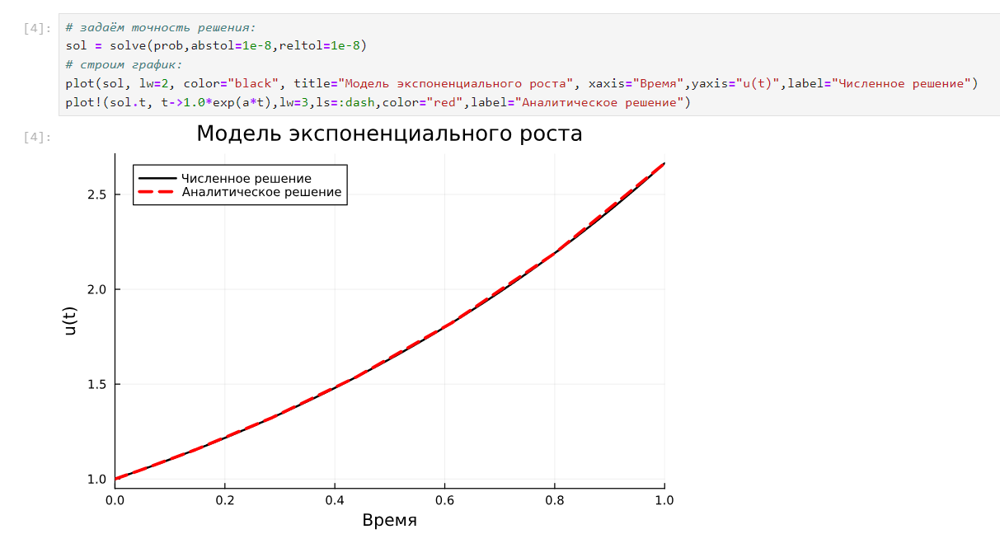
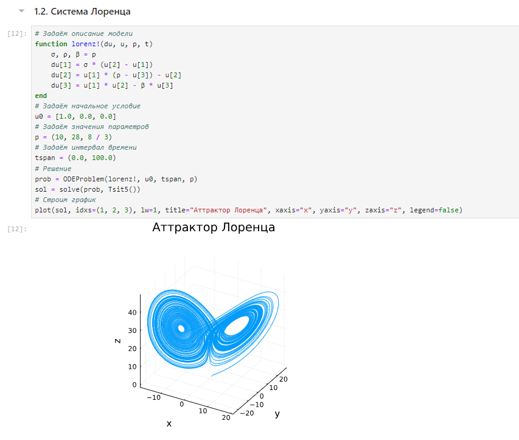
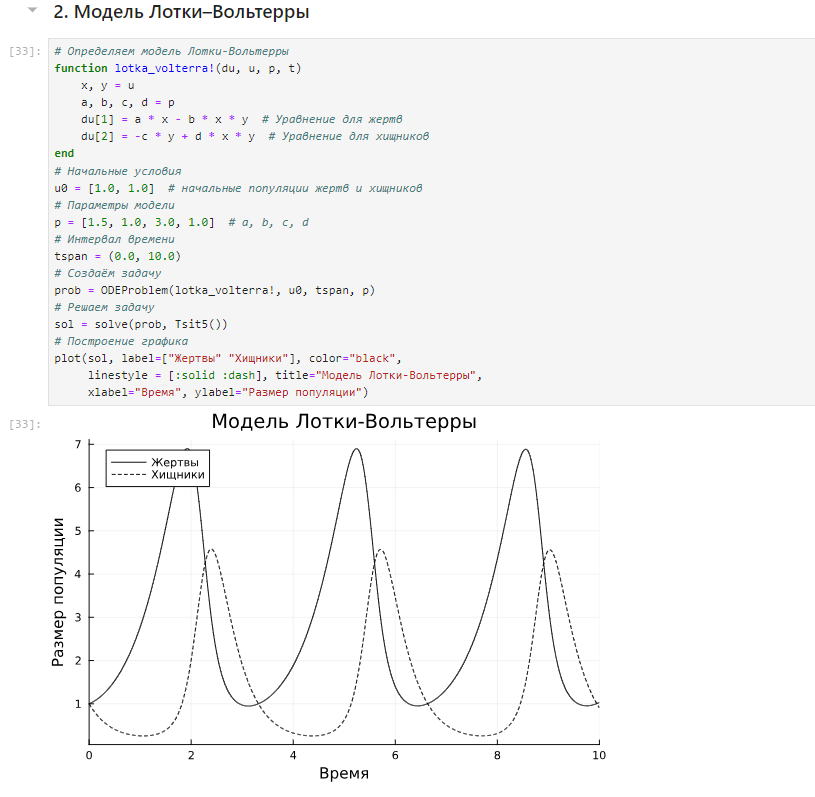
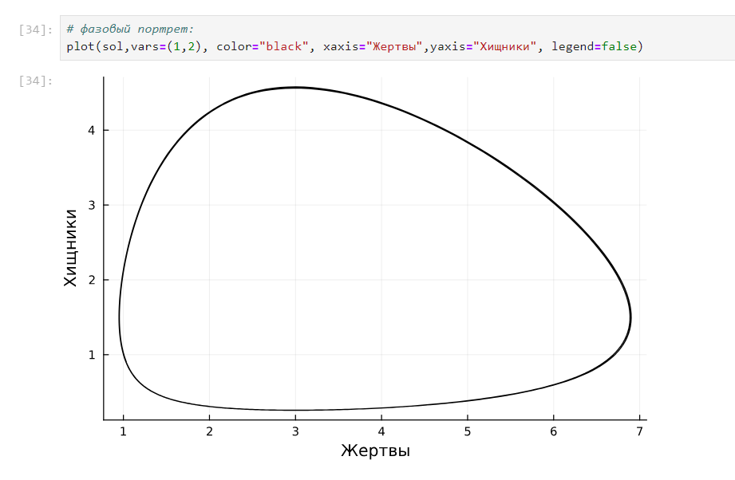
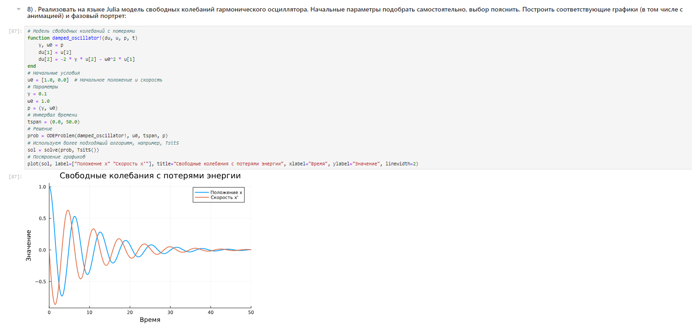

---
## Front matter
lang: ru-RU
title: Лабораторная работа №6
subtitle: Решение моделей в непрерывном и дискретном времени
author:
  - Кузнецова С.В.
institute:
  - Российский университет дружбы народов, Москва, Россия
 
## i18n babel
babel-lang: russian
babel-otherlangs: english

## Formatting pdf
toc: false
toc-title: Содержание
slide_level: 2
aspectratio: 169
section-titles: true
theme: metropolis
header-includes:
 - \metroset{progressbar=frametitle,sectionpage=progressbar,numbering=fraction}
---

# Информация

## Докладчик

:::::::::::::: {.columns align=center}
::: {.column width="70%"}

  * Кузнецова София Вадимовна
  * Российский университет дружбы народов

:::
::: {.column width="25%"}

:::
::::::::::::::

# Цель 

## Цель лабораторной работы

- Освоить специализированные пакеты для решения задач в непрерывном и дискретном времени.

# Выполнение лабораторной работы

## Решение обыкновенных дифференциальных уравнений

Для решения обыкновенных дифференциальных уравнений (ОДУ) в Julia можно использовать пакет diffrentialEquations.jl.

## Модель экспоненциального роста

{ #fig:001 width=80% height=80% }

## Модель экспоненциального роста

{ #fig:002 width=80% height=80% }

## Система Лоренца

{ #fig:003 width=80% height=80% }

## Система Лоренца

{ #fig:004 width=80% height=80% }

## Модель Лотки–Вольтерры

{ #fig:005 width=80% height=80% }

## Модель Лотки–Вольтерры

{ #fig:006 width=80% height=80% }

## Самостоятельная работа

{ #fig:007 width=80% height=80% }

## Самостоятельная работа

{ #fig:008 width=80% height=80% }

## Самостоятельная работа

{ #fig:009 width=80% height=80% }

## Самостоятельная работа

{ #fig:010 width=80% height=80% }

## Самостоятельная работа

{ #fig:011 width=80% height=80% }

## Самостоятельная работа

{ #fig:012 width=80% height=80% }

## Самостоятельная работа

{ #fig:013 width=80% height=80% }

## Самостоятельная работа

{ #fig:014 width=80% height=80% }

# Вывод

## Вывод

- В ходе выполнения лабораторной работы были освоены специализированные пакеты для решения задач в непрерывном и дискретном времени.

# Список литературы. Библиография

[[1] Julia Documentation: https://docs.julialang.org/en/v1/

## {.standout}

Спасибо за внимание!
