---
## Front matter
lang: ru-RU
title: "Отчёт по лабораторной работе №8"
subtitle: "Оптимизация"
author: "Кузнецова София Вадимовна"

 
## i18n babel
babel-lang: russian
babel-otherlangs: english

## Formatting pdf
toc: false
toc-title: Содержание
slide_level: 2
aspectratio: 169
section-titles: true
theme: metropolis
header-includes:
 - \metroset{progressbar=frametitle,sectionpage=progressbar,numbering=fraction}
---

# Информация

## Докладчик

:::::::::::::: {.columns align=center}
::: {.column width="70%"}

  * Кузнецова София Вадимовна
  * Оптимизация

:::
::: {.column width="25%"}

:::
::::::::::::::

## Цель работы

Основная цель работы -- освоить пакеты Julia для решения задач оптимизации.

## Теоретическое введение

Julia -- высокоуровневый свободный язык программирования с динамической типизацией, созданный для математических вычислений. Эффективен также и для написания программ общего назначения. Синтаксис языка схож с синтаксисом других математических языков, однако имеет некоторые существенные отличия.
Для выполнения заданий была использована официальная документация Julia.

# Выполнение лабораторной работы

## Примеры из лабораторной работы

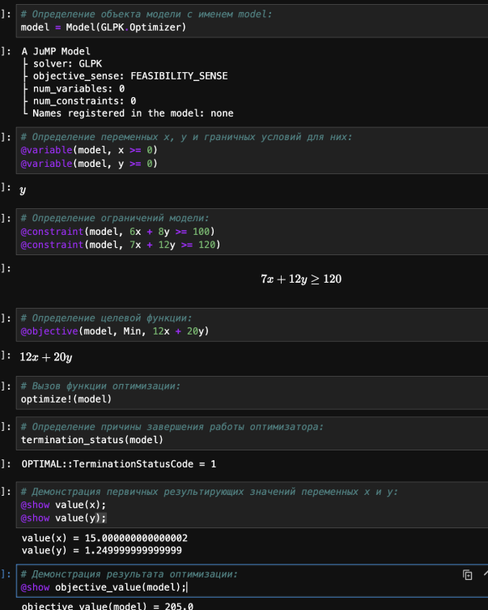{#fig:001 width=35%}

## Примеры из лабораторной работы

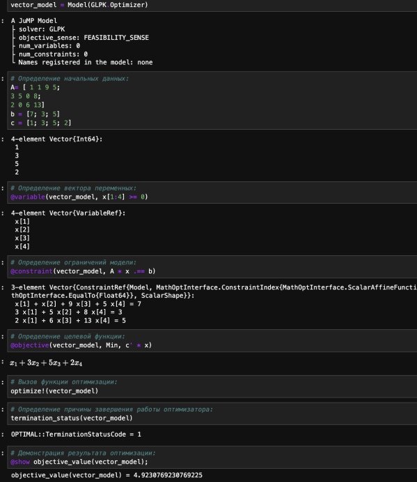{#fig:002 width=35%}

## Примеры из лабораторной работы

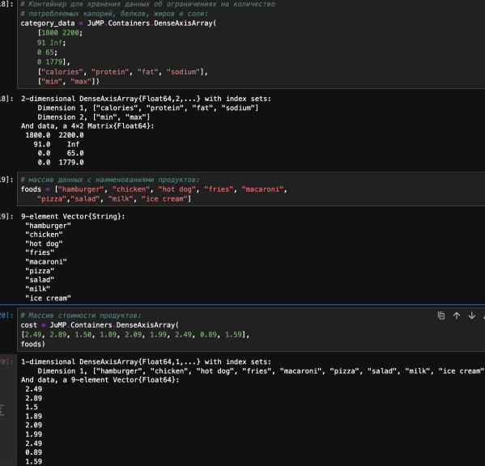{#fig:003 width=50%}

## Примеры из лабораторной работы

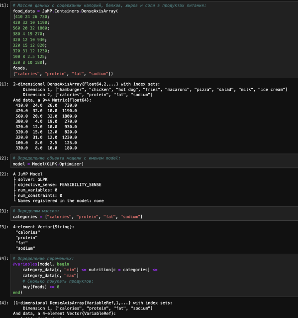{#fig:004 width=40%}

## Примеры из лабораторной работы

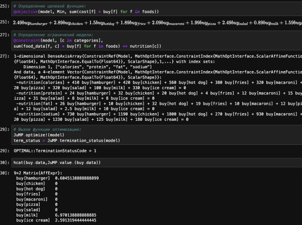{#fig:005 width=50%}

## Примеры из лабораторной работы

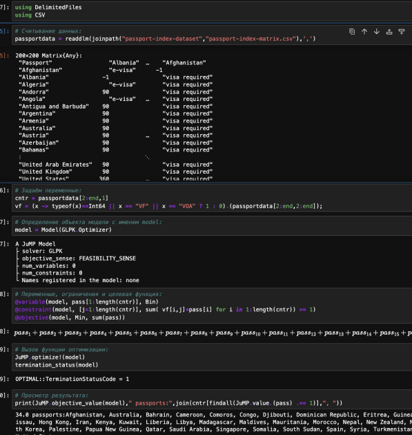{#fig:006 width=40%}

## Примеры из лабораторной работы

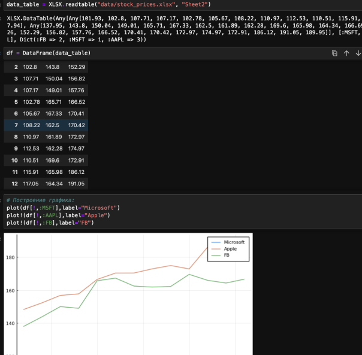{#fig:007 width=50%}

## Примеры из лабораторной работы

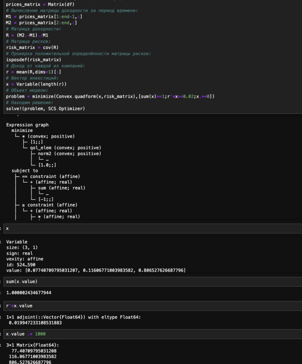{#fig:008 width=35%}

## Примеры из лабораторной работы

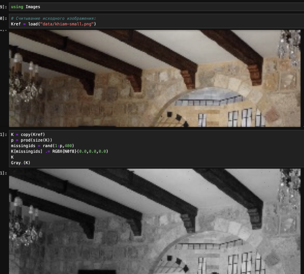{#fig:009 width=50%}

## Примеры из лабораторной работы

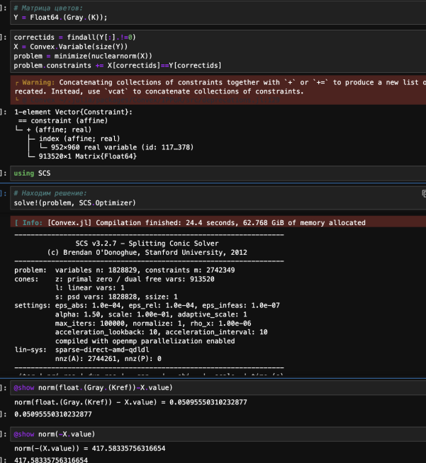{#fig:010 width=35%}

## Примеры из лабораторной работы

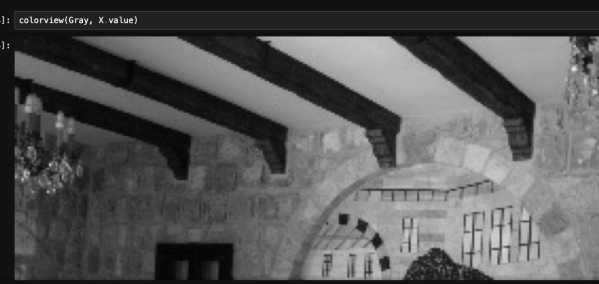{#fig:011 width=50%}

## Задания для самостоятельный работы

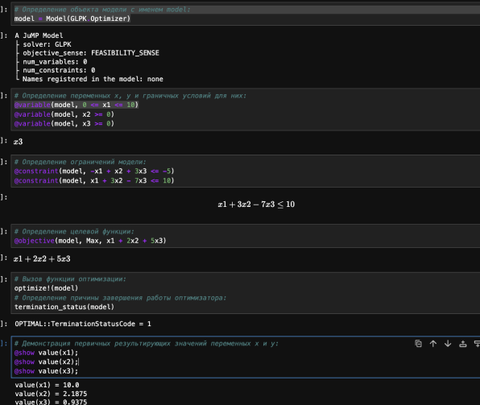{#fig:012 width=50%}

## Задания для самостоятельный работы

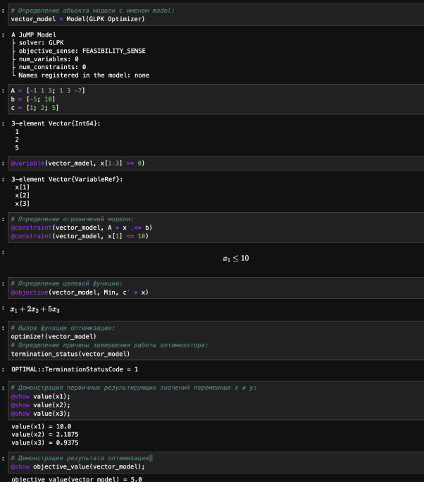{#fig:013 width=35%}

## Задания для самостоятельный работы

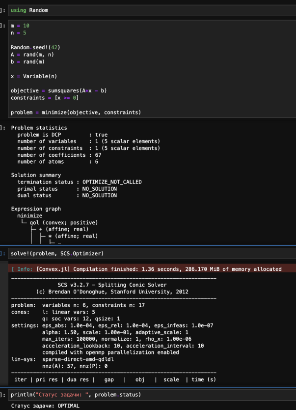{#fig:014 width=35%}

## Задания для самостоятельный работы

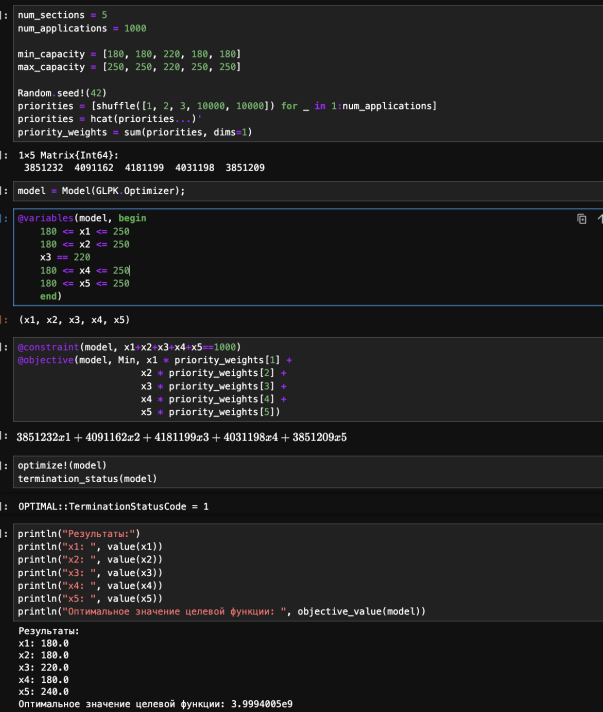{#fig:015 width=35%}

## Задания для самостоятельный работы

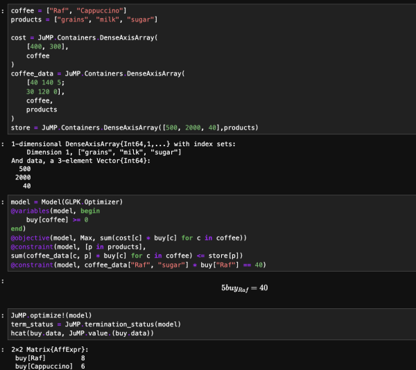{#fig:016 width=50%}

# Вывод

В результате выполнения данной лабораторной работы я освоила пакеты Julia для решения задач оптимизации.

## {.standout}

Спасибо за внимание!
